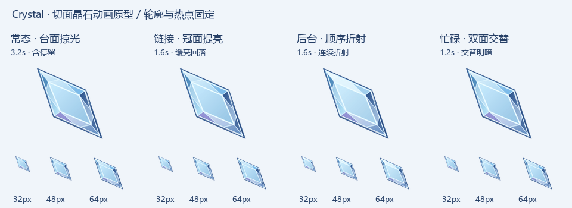
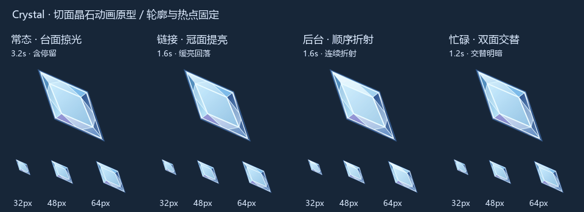

# Crystal · 切面晶石

> **未完成：静态资源仍需继续校对和优化。** 当前最新为第10轮工作稿，尚未获得最终确认、尚未接回动画。[后续待办与接续入口](TODO.md)。

独立的新主题，版本 0.1.0-dev，目前仅有冰蓝动画原型，尚未制作安装包。不是 IceGem 4.3。

保留完整长菱形宝石轮廓，使用中央台面、冠部亮暗切面、连接棱线和窄侧面表现厚度。仅本体内部动画，无常驻程序、晶片或额外特效。

## 预览

上排放大观察切面，下排是 32/48/64px 输出。四种状态分别为常态 3.2s、链接 1.6s、后台 1.6s、忙碌 1.2s。动画几何固定，仅内部明暗变化。

## 设计来源

[已确认的静态造型](docs/shape-approved.png) · [动画关键帧](docs/motion-storyboard.png)。这些历史设计图仍带 IceGem 4.3 字样，仅保留溯源；本主题独立命名与版本管理。原型补充冠部明暗三角面、台面折射、内缘亮棱和窄侧面厚度。

## 构建

使用 Pillow 与 CairoSVG，运行 `python tools/preview_motion.py`，只生成 preview 文件。尚未验证实际系统光标加载，预览不等同于可安装主题；最终发行压缩包将放入本主题 dist。

本轮边缘细化：外沿窄腰棱、内缘倒角亮线、冠部交替明暗切面，减薄外描边；保留完整台面与侧面厚度。名称已确认为 Crystal（切面晶石）。

中央台面按照已确认设计稿保持单一平整面：移除内部三角分区与主棱线，只保留连续柔和反光及掠过光带。切割结构仅位于外围冠部、腰棱和侧面。

## 静态校准（待确认）

[设计参考 / 上一版 / 校准稿并排对照](preview/static-study-02.png) · [可编辑 SVG](preview/static-study-02.svg)。长轴约 37°，中央台面保持平整，外围改为非等宽冠部、分段反射和窄侧面。静态稿独立位于 `tools/static_study.py`，尚未替换上面的动画。

最新静态校准：[第03轮同尺度对照](preview/static-study-03.png) · [SVG](preview/static-study-03.svg)。使用 `tools/static_trace.py`，按已确认设计稿静置局部定位外轮廓、偏心台面与冠部交界；保持中央连续平面，外围恢复分段折射与尖端汇聚。尚未替换动画。

第04轮静态校准：[原稿对照](preview/static-study-04.png) · [SVG](preview/static-study-04.svg)。保留已接近参考的切面布局，将尖端和肩角改为轻微圆润过渡，腰棱及内侧反光线采用连续曲线，台面仅做极小边角过渡，仍是单一平面。尚未替换动画。

第05轮静态校准：[对照图](preview/static-study-05.png) · [SVG](preview/static-study-05.svg)。缩小顶部过大的白面，恢复冠部明暗层次，增加切面内连续反射与右侧窄面亮带；保持上一轮的微圆边角和完整平整台面。仍未替换动画。

第06轮静态校准：[对照图](preview/static-study-06.png) · [SVG](preview/static-study-06.svg)。从参考对应切面内部采样并拟合连续颜色梯度，修正顶部亮面及侧面色温；不改变完整台面和轮廓。构建依赖参考图，输出 SVG 自包含，不依赖原图运行。尚未替换动画。

第07轮曲率校准：[整体对照](preview/static-study-07.png) · [四角细节](preview/corner-study-07.png)。按尖端/肩角分别设置过渡长度，外缘与内侧亮棱共用圆角几何；中央台面和参考配色保持不变，尚未替换动画。

第08轮曲率校准：[整体](preview/static-study-08.png) · [尖端及台面细节](preview/corner-study-08.png)。扩大上下尖端圆弧，中央台面四角与边线统一为抛光路径，移除伸至旧尖角的直线高光；仍保持单一平整台面，暂未替换动画。

第09轮厚度校准：[整体对照](preview/static-study-09.png) · [SVG](preview/static-study-09.svg)。在固定外轮廓内增加窄侧面填充带与亮倒角，构成亮、灰、暗的腰棱层次；保留圆润尖端和完整台面，尚未替换动画。

第10轮尖端校准：[整体](preview/static-study-10.png) · [双尖端](preview/corner-study-10.png)。肩部侧面厚度保留，两端内缩量降低并柔和淡出亮棱，消除包头式亮圈；中央台面不变，尚未替换动画。
