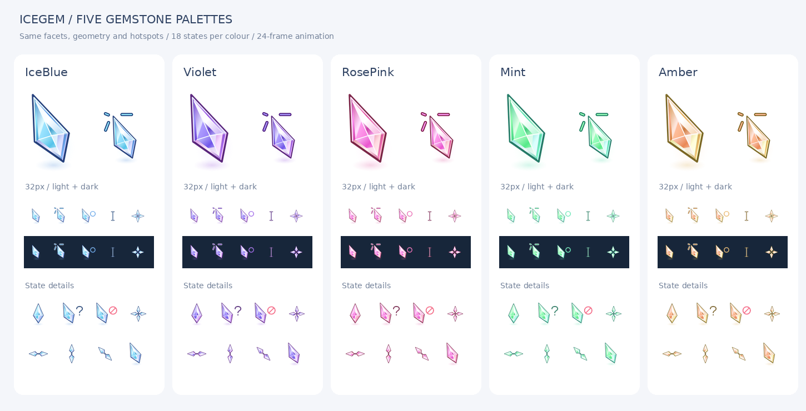

# IceGem · 冰晶宝石光标

冰蓝、紫罗兰、玫瑰粉、薄荷绿、琥珀五套配色，沿用修长晶体造型和加强版点击线条。



## 4.1 更新

- 后台运行：旋转单光弧、渐亮尾迹与晶体端点。
- 忙碌等待：双光弧环绕冰晶，强化运行状态辨识度。
- 五色 Windows / Linux 资源同步更新，保持原有热点及静态方案。

## Windows 下载与安装

[下载 4.1 五色完整安装包](dist/IceGem-4.1-Color-Collection.zip?raw=true)。解压完整文件夹后双击对应入口：

| 颜色 | 文件 |
|---|---|
| 冰蓝 | Install-IceBlue.cmd |
| 紫罗兰 | Install-Violet.cmd |
| 玫瑰粉 | Install-RosePink.cmd |
| 薄荷绿 | Install-Mint.cmd |
| 琥珀 | Install-Amber.cmd |

默认动态 multi 方案，无需管理员权限。每色注册独立静态/动态方案，已安装的颜色可在 Windows 鼠标属性 → 指针中切换。安装包内的 IceGem-Colors-Preview.html 支持五色动画预览与悬停测试。

## Linux / Zorin OS

[下载 Linux 4.1 完整安装包](dist/IceGem-4.1-Linux.tar.gz?raw=true) · [安装、换色、恢复与卸载说明](linux/)

五色动态/静态共十套原生 Xcursor 主题，支持 24/32/48/64/96px。解压后进入 `IceGem-Linux`，运行 `bash Install.sh`，默认应用冰蓝动态版、32px，无需 sudo。Linux 构建器与安装脚本位于 `linux/`，复用 `variants/` 中的配色渲染源码。Zorin 桌面显示、动画及多屏/DPI 尚待实机验收。

## 规格与目录

- 每色 18 种状态，32/48/64px 和多分辨率 CUR。
- 正常、后台忙碌、等待提供 24 帧 ANI。后台运行使用单弧旋转光环，忙碌使用环绕晶体的双弧与渐亮尾迹，均为 1.6 秒连续循环，热点固定。
- [查看五色忙碌动画](preview/busy-motion.gif)：每格上方为 64px、下方为 32px，分别展示浅色与深色背景；需要减少动态时安装 Static 方案。
- Link 使用原晶体＋高对比点击放射线；文本保持已缩小的尺寸。
- `variants/<配色>/`：SVG 源文件、构建器、安装脚本、热点映射与校验记录。
- `preview/`：主题总览；`dist/`：可直接使用的完整安装包。
- 仓库不重复存放生成的 CUR/ANI、动画逐帧 SVG 和大体积内嵌预览 HTML；它们均在安装包中，也可从源码重建。

## 从源码构建

需要 Python 3、Pillow、CairoSVG 及 Cairo 系统库；预览生成还使用 DejaVu Sans 字体。推荐 Linux 构建环境。

```bash
python -m pip install -r themes/icegem/requirements.txt
python themes/icegem/tools/build_all.py
```

产物写入每种配色目录中的 cursors、src/animation、preview，随后自动检查 CUR/ANI 结构。此时该配色目录下 Install.cmd 可直接使用。仅查看静态源码无需安装依赖。

## 恢复与卸载

在解压包目录执行 `Install-IceBlue.cmd -Action Restore` 恢复首次安装前的指针；`Install-IceBlue.cmd -Action Uninstall` 恢复并卸载共同管理的所有 IceGem 配色。不同配色共用首次备份，支持已有 IceGem 版本更新。`Check-Link.cmd` 检查当前 Link 的文件与注册表映射。

## 验证与边界

二进制结构、透明轮廓、热点及动画帧检查已通过。本次五色光标通过 Windows LoadImage 的 32/48/64px 原生加载检查；后台运行与忙碌另外通过 24/32/48/64/96px 边界、热点、24 帧差异及循环衔接检查。Windows 安装、桌面连续播放和跨 DPI 切换仍未实机验收。32/48/64 表示资源分辨率，不是显示大小选项。竖排文本无独立全局槽位，系统方案不覆盖应用自行绘制的全部光标。
