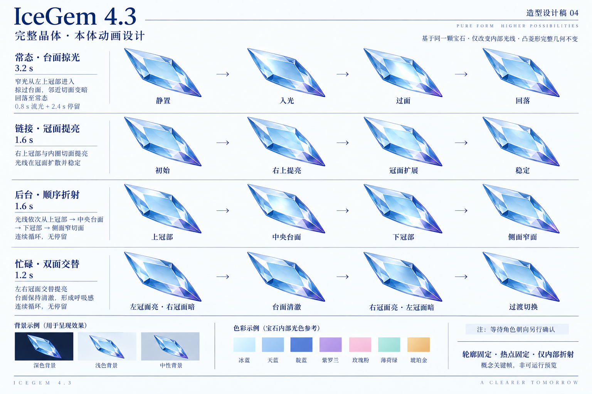
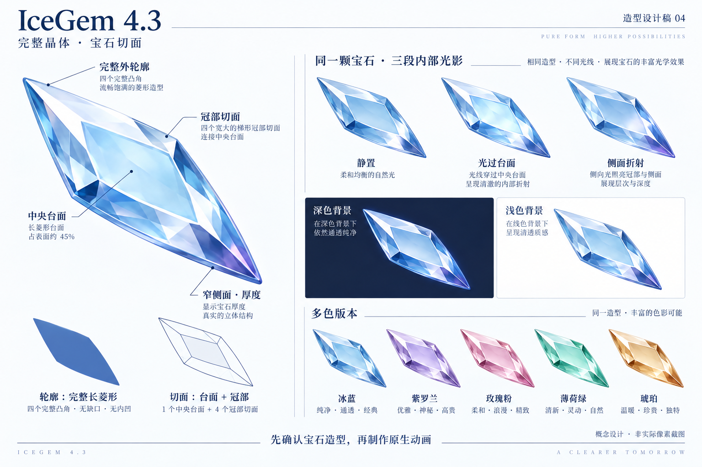
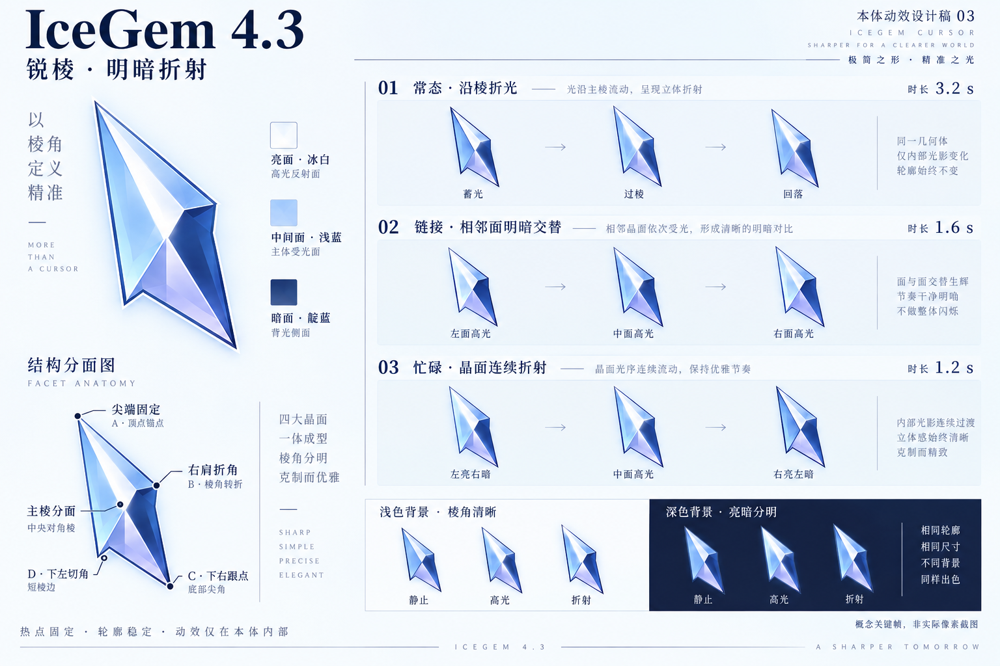
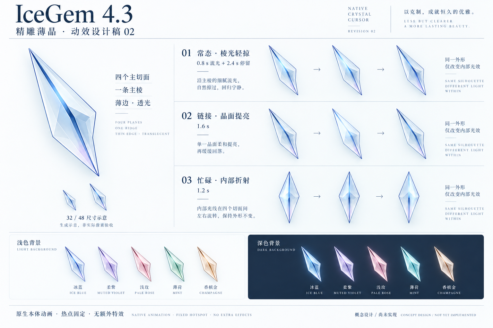

> 历史设计记录：此方案已迁移为独立的 [Crystal 主题](../../crystal/)，不再计划作为 IceGem 4.3。以下标题与版本仅为保留设计沿革。

# IceGem 4.3 · 本体动效设计

状态：设计提案，尚未实现或发布。4.2 的 Companion、跟随晶片、点击闪光及悬停外部折光归为实验；历史包保留，4.3 发行目标不包含 Companion。

## 当前动画提案：基于已确认的第四版静态造型

第四版静态宝石造型已获确认。后续不改其完整轮廓、中央台面和冠部结构，只调整内部光照。上图由内置 imagegen 以已确认造型为参考生成，是动画关键帧概念，不是运行录屏；图中文字“造型设计稿04”继承自参考图，本文件名区分动画稿。

| 动画 | 光影路径 | 时序与循环 |
|---|---|---|
| 常态 | 上冠部入光 → 窄光带跨过中央台面 → 下侧面回落 | 0–0.8s 掠光，0.8–3.2s 停留；30fps 动作帧 + 长停留帧 |
| 链接 | 右上冠面与台面内缘一起提亮，邻面保留暗部 | 1.6s 周期，前半缓亮、后半回落；末帧回接首帧，不能真的永久停在“稳定”帧 |
| 后台 | 上冠部 → 台面 → 下冠部 → 窄侧面 | 1.6s 持续循环，四段约各0.4s，段间柔和交接，无停留 |
| 忙碌 | 左冠亮/右冠暗 → 台面折射 → 右冠亮/左冠暗 → 回接 | 1.2s 持续循环，四段约各0.3s；亮暗交替但不整颗闪烁 |

统一约束：热点和外轮廓逐帧不变；高光严格裁剪在切面内；颜色渐变而非切面突跳；台面始终保留中间色，不能亮成一块白板。忙碌先沿用同一静态造型作光影研究，等待角色最终朝向在真实原生预览中确认。点击、任意拖动、速度反馈不纳入无常驻程序的原生方案。

下一步先制作冰蓝四状态的真实 32/48/64px 深浅背景循环预览，检验后台与常态差异、忙碌节奏、小尺寸明暗以及循环接缝，再扩展五色。

## 已确认静态造型：04 · 完整晶体与宝石切面

优先确认完整宝石形态：无凹口的斜向长菱形轮廓、中央台面、周围冠部切面和窄侧面。体积来自完整台面与相邻面的明暗折射，不再采用箭头式凹口或刀片造型。先确认静态造型，再制作原生本体动画。

使用内置 imagegen 生成；提示词要求完整凸四边形轮廓、约 45% 中央台面、四个主要冠部切面、窄侧面厚度、五色和深浅背景对照。图中附加小反射切面仅为材质概念，32px 实现需减少这些细节；大图不能作为小尺寸清晰度验收依据。图示长宽比和倾斜角度尚未定稿，所有动画仍保持热点和外轮廓稳定。

## 第三版留档：03 · 锐棱与明暗折射

保留修长比例，强化右肩和底部折角。以冰白亮面、浅蓝中间面和窄幅靛蓝暗面构成立体关系，主棱连接四个主要切面。流光经过主棱时相邻面产生明暗对照，避免整块变白或整体闪烁。

使用内置 imagegen 生成；提示词重点为锐利折角、四至五个大切面、三层明暗、固定轮廓下的内部折射，以及深浅背景对照。本稿用于确认材质方向：图中忙碌行仍画成斜指针，正式忙碌角色仍应采用下表规定的中央对称晶体；图中的轻微外部柔光和投影不纳入实现。生成关键帧不代表真实的动画变化幅度，后续需原生帧预览验证。几何不得直接采用图中个别帧的凹口或轮廓偏差。

## 第二版留档：02 · 精雕薄晶

收敛为四个主要切面与一条主棱，修长轮廓、冰白浅蓝主体、薄暗边；高光沿棱线移动后消退，避免碎亮点与大块浓蓝。沿用下面的角色范围及原生实现边界。

第二版通过内置 imagegen 生成，侧重材质与比例；板中的小尺寸为生成示意，不代表真正的 32/48px 渲染。深色示意存在柔光，正式实现应去掉轮廓外光晕及投影，保持本体内折射。概念板只列三个代表状态，后台与缩放等状态仍按下表设计。

[第一版留档](motion-design-4.3-01.png)

## 核心方向

仅用当前角色的指针本体表达状态。保留五色与修长切面；取消伴随晶片、外部光环、散射线、粒子、拖尾和常驻程序。光线限制在轮廓以内，增强切面间明暗变化而不是整体闪烁。移动位置由系统直接控制；点击尖端、热点与外轮廓保持稳定。

图为 imagegen 生成的概念关键帧，不是可运行预览，也不能据此判断 32px 实际清晰度。箭头只表示关键帧顺序，不属于光标图案。最终几何沿用仓库源图，参考设计板的光影关系，不照搬生成图的形状偏差。

## 状态与时序

| 状态 | 本体动画 | 建议周期 | 约束 |
|---|---|---|---|
| 正常选择 | 中央亮棱向尾部扫过，右侧切面依次响应，随后停留 | 3.2s：0.8s流光 + 2.4s停留 | 不改变轮廓，不产生尾迹 |
| 链接选择 | 内侧棱线与中央三角面提亮，缓慢回落 | 1.6s | 由系统 Hand 角色触发；不能承诺精确的进入/离开过渡 |
| 后台运行 | 单条内部折射带按上、中、下切面推进 | 1.6s | 移除外部小圆环；与常态相比持续且更明显 |
| 忙碌等待 | 中央对称晶体保持静止，左右大切面交替折射 | 1.2s | 移除双轨道；避免整体亮灭或快速闪烁 |
| 移动 / 缩放 | 光沿箭头轴线传向端部，端面依次点亮 | 1.8s | 中心与端点固定，不扩大箭头 |
| 帮助 / 位置 / 人员 | 主体短程扫光；语义符号保留且静止 | 2.4s | 原有角色标记属于识别图形，不新增装饰 |
| 文本 / 精确 / 手写 / 不可用 / 替代选择 | 静态清晰切面 | 静态 | 优先保持定位和语义清晰 |

动画目标 30fps。32px 下保留 3–4 个主要明暗面与清晰外缘；48/64px 再增加次级切面。热点处保持可见像素，内部亮线不依赖小于一个输出像素的细节。五色共享几何与时序，深浅背景分别验证。

## 原生实现边界

Windows 使用 CUR / ANI，Linux 使用 Xcursor；不依赖输入监听或透明覆盖窗口。系统角色变化驱动状态，不能把鼠标按下、释放、拖动或移动速度当成原生动画触发器。这里的移动状态指系统 Move 角色，不等同于任意拖动。

链接动画是一段循环，不承诺在每次进入链接时从第一帧播放。不提供独立点击特效、拖动收束、跟随或按速度变形。提供完整 Static 方案；不能假定 ANI 会自动响应系统“减少动画”设置，需用户显式选择静态方案。

## 下一阶段验收

1. 先实现冰蓝正常、链接、后台、忙碌四个角色，生成真实 32/48/64px 深浅背景预览。
2. 对比常态与后台是否易于区分，确认忙碌内部折射具有足够动感。
3. 验证各帧热点与轮廓一致、循环接缝、实际系统加载；再扩展五色和其余角色。
4. 用户确认后生成 4.3 包，仅放在 dist；不覆盖 4.2 实验归档和 4.0 Static 稳定基线。

## 设计稿生成说明

使用内置 imagegen。提示词概要：六宫格中文原生冰晶光标动效板；常态、链接、后台、忙碌、调整、精确六种状态；所有光影在本体轮廓内部；固定热点和轮廓；无晶片、粒子、外部光环或拖尾；五色及明暗背景对照。
